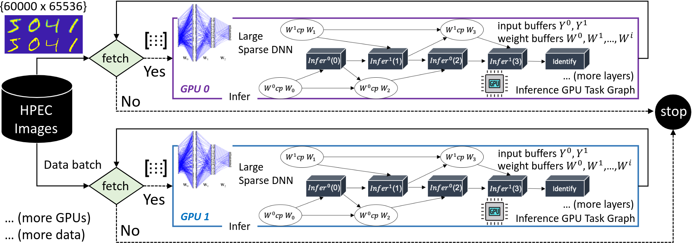
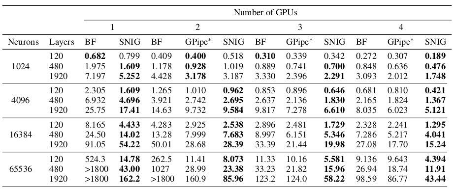
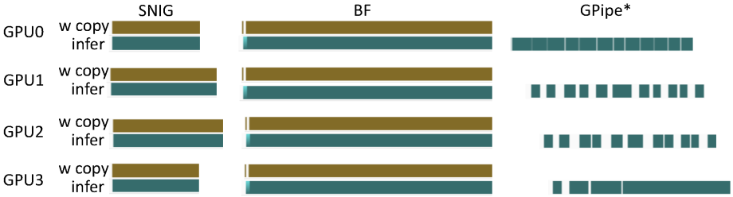
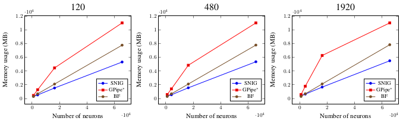

Accelerated Large Sparse Neural Network Inference using Task Graph Parallelism 

[](https://www.codacy.com/manual/dian-lun-lin/SNIG?utm_source=github.com&amp;utm_medium=referral&amp;utm_content=dian-lun-lin/SNIG&amp;utm_campaign=Badge_Grade)

# Problem Statement

SNIG is an inference engine for the [MIT/Amazon/IEEE HPEC Sparse Deep Neural Network Graph Challenge](./https://graphchallenge.mit.edu/challenges). 

We develop highly optimized inference kernels and leverage the power of CUDA Graphs to enable efficient decomposition of model and data parallelisms.
<p align=center>

</p>

# Step 1 : Compile SNIG

To compile SNIG, you need :
 * Nvidia CUDA Toolkit and Compiler ([nvcc](https://developer.nvidia.com/cuda-llvm-compiler)) at least v10.0 with -std=c++14.
 * GNU C++ Compiler at least v5.0 with -std=c++14.
```bash
~$ nvcc --version    # NVCC must present with version at least v10.0
~$ g++ --version     # GNU must present with version at least v5.0
```

We recommend out-of-source build with cmake:

```bash
~$ mkdir build
~$ cd build
~$ cmake ../
~$ make
```
You will see executable files (`snig` and `to_binary`) under `bin/`.
To run SNIG with the smallest benchmark under 1 GPU, you can simply type :

```bash
~$ cd bin
~$ ./to_binary --sample_data true
~$ ./snig
```

To run other benchmarks, you need to download the dataset from MIT/IEEE/Amazon Graph Challenge.

# Step 2: Download the Dataset

You can download the dataset either by yourself or by our script.
## Download the dataset by our script (Linux):
```bash
~$ cd bin
~$ ./get_dataset.sh (num_neurons --all)

"./get_dataset.sh 1024" would download and extract benchmarks with 1024 neurons
"./get_dataset.sh --all" would download and extract all benchmarks
```
Check ``` ~$ ./get_dataset.sh -h``` for more details.
Note that this script may fail to get the dataset due to various environment.

## Download the dataset manually :
The dataset is available at https://graphchallenge.mit.edu/data-sets

Firstly, create directories to store the dataset :

```bash
~$ mkdir dataset
~$ mkdir dataset/MNIST
~$ mkdir dataset/weight
```

After downloading and extracting the dataset, 
you need to move the input dataset and golden reference to ```dataset/MNIST/``` and the model to ```dataset/weight/```, respectively.

The file paths should be like :

```
./dataset/weight/neuron1024/{*.tsv}
./dataset/MNIST/neuron1024-l120-categories.tsv
./dataset/MNIST/sparse-images-1024.tsv
```

# Step 3: Transform the Benchmarks to Binary Format

Computing the raw dataset is extremely time-consuming.
To execute SNIG, you need to transform the benchmarks to binary format first.
**Make sure the benchmark (model, input data, golden reference) you want to transform is already stored in** ```dataset/```.
 
``` bash
~$ cd bin
~$ ./to_binary --num_neurons(--convert_all)

"./to_binary --num_neurons 16384"  would convert benchmarks with 16384 neurons to binary format
"./to_binary --convert_all true" would convert all benchmarks to format
```
Note that converting all benchmarks would take some time.
Check ``` ~$ ./to_binary -h``` for more details.


# Step 4 : Run SNIG on a Specific Benchmark

Move to the `bin` directory:

```bash
~$ cd bin
```

You can use either ```./snig ``` for setting details or our srcipt ```./executor.sh``` with tuned parameters.
## For ```executor.sh``` :
```bash
~$ ./execuator.sh mode (SNIG, BF, GPipe) num_neurons num_layers num_gpus
  
"./executor.sh SNIG 65536 1920 4" use SNIG to peform the benchmark with 65536 neurons and 1920 layers under 4 GPUs
"./executor.sh BF 4096 1920 2" use BF to perform the benchmark with 4096 neurons and 1920 layers under 2 GPUs
```

Check ``` ~$ ./executor.sh -h``` for more details.

## For ```snig``` :
```bash
~$ ./snig --mode --weight --input --golden --num_neurons --num_layers --bias --num_gpus --num_weight_buffers --input_batch_size --thread_dimension
  
"./snig  -m SNIG -w ../dataset/weight/neuron4096/ -i ../dataset/MNIST/sparse-images-4096.b -g ../dataset/MNIST/neuron4096-l480-categories.b -n 4096 -l 480 -b -0.35 --num_gpus 3 --input_batch_size 5000 --num_weight_buffers 2 --thread_dimension 2 512 1"
```

Check ```~$ ./snig -h ``` for more detials.

### Command Options for ```snig```
```
-h,--help                   Print this help message and exit
-m,--mode                   select mode(SNIG, GPipe, or BF), default is SNIG
-w,--weight                 weight directory path, default is ../sample_data/weight/neuron1024/
-i,--input                  input binary file path, default is ../sample_data/MNIST/sparse-images-1024.b
-g,--golden                 golden binary file path, default is ../sample_data/MINIST/neuron1024-l120-categories.b
-n,--num_neurons            total number of neurons, default is 1024
-l,--num_layers             total number of layers, default is 120
-b,--bias                   bias, default is -0.3
--num_gpus                  number of GPUs, default is 1
--num_weight_buffers        number of weight buffers, default is 2,  must be an even number
--input_batch_size          number of input bath size, default is 5000, must be a factor of the total number of inputs (60000)
-t,--thread_dimension       thread dimension for inference kernel, need 3 parameters, default is 2 512 1,  constrained by the maximum number of threads (typically 1024)
```

# Results
All experiments ran on a Ubuntu Linux 5.0.0-21-generic x86 64-bit machine with 40 Intel Xeon Gold 6138 CPU cores at 2.00 GHz, 4 GeForce RTX 2080 Ti GPUs with 11 GB memory, and 256 GB RAM. We compiled all programs using Nvidia CUDA nvcc 10.1 on a host compiler of GNU GCC-8.3.0 with C++14 standards -std=c++14 and optimization flags -O2 enabled. All data is an average of ten runs with float type.

Overall runtime performance of SNIG, BF, and GPipe∗ across one, two, three, and four GPUs. All data is reported in seconds. Bold text represents the best solution in the corresponding benchmark. All results match the golden reference provided by the MIT/IEEE/Amazon Sparse DNN Challenge.


<p align=center>
Execution timeline of each method on completing 65536 neurons and 1920 layers under 4 GPUs :

</p>

<p align=center>
Maximum memory usage under 4 GPUs :

</p>

## Baseline Implementation

You can refer to :

[bf.hpp](./SNIG/bf/bf.hpp) and [kernel.hpp](./SNIG/bf/kernel.hpp) for our implementation of the [BF method](https://doi.org/10.1109/HPEC.2019.8916223)

[gpipe.hpp](./SNIG/gpipe/gpipe.hpp) and [kernel.hpp](./SNIG/snig/kernel.hpp) for our implementation of the [GPipe*](https://papers.nips.cc/paper/8305-gpipe-efficient-training-of-giant-neural-networks-using-pipeline-parallelism)

# Reference

+ [A GPU Implementation of the Sparse Deep Neural Network Graph Challenge](https://doi.org/10.1109/HPEC.2019.8916223)
+ [GPipe: Efficient Training of Giant Neural Networks using Pipeline Parallelism](https://papers.nips.cc/paper/8305-gpipe-efficient-training-of-giant-neural-networks-using-pipeline-parallelism)
